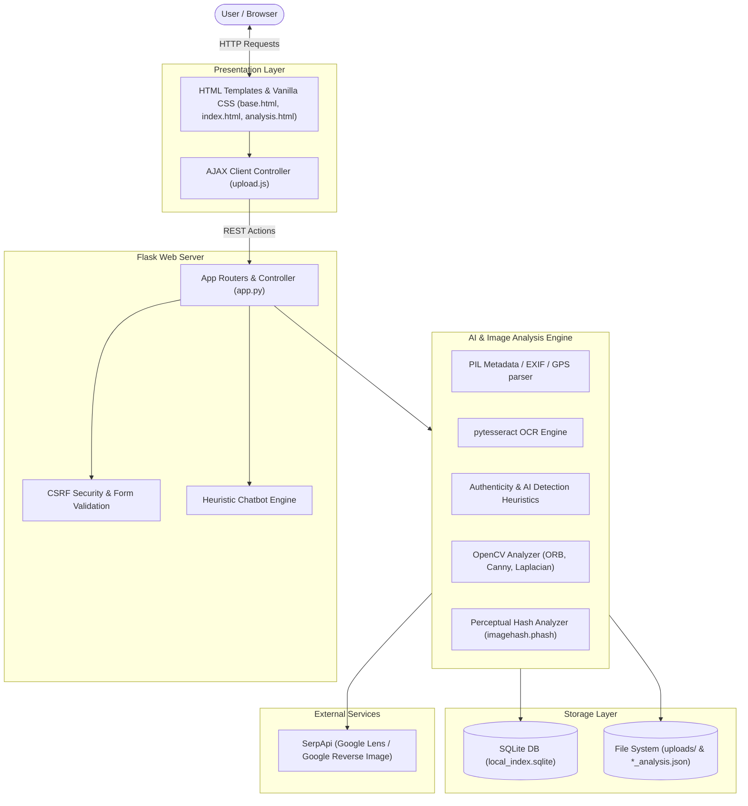
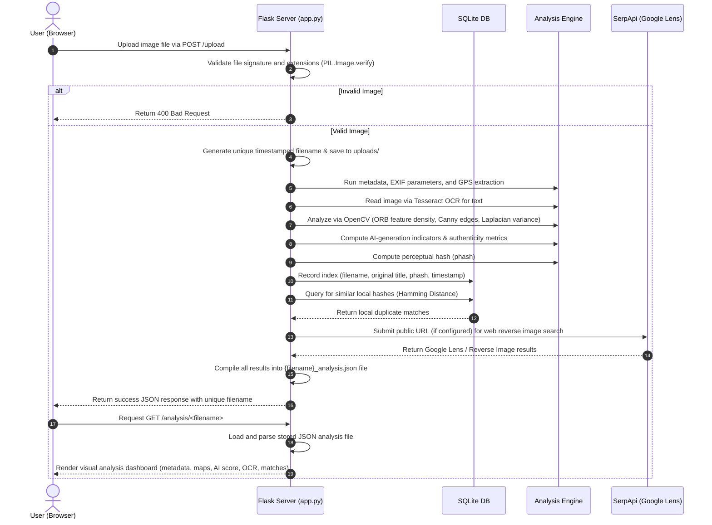

# 🛰️ PicIntel

**AI-powered Image Intelligence for the Digital Age**

---

### 🧩 Overview
In an era where digital media can be easily manipulated, misattributed, or synthesized, verifying the integrity and source of images is crucial. **PicIntel** is a lightweight, responsive, and advanced **Open Source Intelligence (OSINT)** platform. It allows users to verify image authenticity, extract EXIF metadata, perform reverse image searches on local and global databases, and detect signs of AI generation—all in one seamless, interactive dashboard.

---

### 🔍 Key Features

*   **Authenticity Check & Manipulation Analysis**:
    *   Computes texture features and spatial patterns via OpenCV's `ORB` (Oriented FAST and Rotated BRIEF).
    *   Assesses file compression ratio and compares spatial structure consistency.
    *   Flags anomalies suggesting smoothing, editing, or structural modification.
*   **AI-Generation Verification (Local Heuristics)**:
    *   Measures color saturation metrics in the HSV color space.
    *   Analyzes texture sharpness using OpenCV Laplacian variance calculations.
    *   Detects dimensions typical of popular AI generative models (e.g., $512\times512$, $768\times768$).
*   **Comprehensive Metadata & GPS Intelligence**:
    *   Extracts basic file parameters (dimensions, format, color space, mode).
    *   Retrieves complete EXIF data (camera model, software, exposure settings, timestamp).
    *   Parses GPS coordinates, converting them to decimal degrees, and generates a dynamic Google Maps locator link.
*   **Optical Character Recognition (OCR)**:
    *   Uses PyTesseract to extract overlay, embedded, or scanned text from uploaded images.
*   **Hybrid Reverse Image Search**:
    *   **Local Library Search**: Indexes uploaded images using Perceptual Hashing (`imagehash.phash`) in SQLite and maps similar images using Hamming distance.
    *   **Web Reverse Search**: Seamlessly queries SerpApi (Google Lens primary search and Google Reverse Image fallback) using temporary public endpoints, presenting deduplicated, ranked search results.
*   **Guided OSINT Chatbot**:
    *   Includes a client chatbot interface with quick triggers to guide users through image analysis procedures.

---

### ⚙️ Tech Stack

| Technology | Purpose | Description |
| :--- | :--- | :--- |
| **Flask** | Application Framework | Serves the web endpoints, handles forms, routes, and JSON API payloads. |
| **SQLite3** | Local Database | Stores file indices, perceptual hashes, and image metadata for matching. |
| **OpenCV (headless)** | Computer Vision | Performs feature point detection (ORB), Canny edge complexity detection, Laplacian variance, and HSV space extraction. |
| **Pillow (PIL)** | Image Processing | Handles file parsing, verification, rendering, format conversion, and EXIF extraction. |
| **PyTesseract** | OCR Engine | Interfaces with Tesseract OCR to read text embedded in graphics. |
| **imagehash** | Perceptual Hashing | Generates discrete `phash` hashes to recognize duplicates regardless of compression. |
| **SerpApi** | Search Integration | Queries Google Lens and Google Images for matches. |
| **Flask-WTF / WTForms** | Validation & Security | Ensures CSRF protection and validates uploaded image signatures. |

---

### 📂 Project Structure

```text
PicIntel-1/
├── app.py                  # Main Flask application containing routes, APIs, and image processors
├── config.py               # Global application configuration properties
├── requirements.txt        # Python dependency manifest
├── seed_index.py           # Helper script to populate the local library database using seed images
├── bannernew.png           # Repository brand header banner image
├── local_index.sqlite      # SQLite database storing perceptual hashes of indexed images
├── seed_images/            # Pre-collected directory of images used to seed the local search database
├── static/
│   ├── js/
│   │   └── upload.js       # Asynchronous drag-and-drop file uploader and progress controller
│   └── uploads/            # Dynamic storage for uploaded images and analysis report JSON files
└── templates/
    ├── base.html           # Master layout containing navigation and shared UI headers
    ├── index.html          # Drag-and-drop dashboard for image uploads
    ├── analysis.html       # Visual dashboard showing metadata, EXIF, reverse matches, and AI metrics
    └── chatbot.html        # Interactive help and guidance interface
```

---

### 🏗️ System Architecture

The following diagram maps the structural components of **PicIntel**:



---

### 🔄 Operational Workflow

The step-by-step transaction flow during image upload and OSINT analysis:



---

### 📡 API Documentation

#### 1. Upload & Analyze Image
*   **Route**: `/upload`
*   **Method**: `POST`
*   **Form Parameters**:
    *   `file`: The binary image payload (JPEG, PNG, WebP, GIF, BMP, TIFF; Max 16MB).
*   **Responses**:
    *   **Success (200 OK)**:
        ```json
        {
          "success": true,
          "filename": "20260626_211344_image.png",
          "message": "Analysis complete"
        }
        ```
    *   **Failure (400 Bad Request / 500 Server Error)**:
        ```json
        {
          "success": false,
          "error": "Only image files are allowed (PNG, JPG, JPEG, GIF, BMP, TIFF, WEBP)"
        }
        ```

#### 2. Retrieve Analysis Page
*   **Route**: `/analysis/<filename>`
*   **Method**: `GET`
*   **Description**: Renders the complete web dashboard for a specific uploaded image based on its pre-generated `{filename}_analysis.json`.

#### 3. Conversational Assistant
*   **Route**: `/chat`
*   **Method**: `POST`
*   **Request JSON Payload**:
    ```json
    {
      "message": "how to upload?"
    }
    ```
*   **Response JSON Payload**:
    ```json
    {
      "success": true,
      "response": {
        "text": "Click Choose File → select an image → Analyze. Max 16MB. Formats: PNG/JPG/JPEG/WebP/TIFF/GIF.",
        "type": "guide"
      },
      "timestamp": "2026-06-26T21:13:44.123456"
    }
    ```

#### 4. Rescan External Web Matches
*   **Route**: `/rescan/<filename>`
*   **Method**: `POST`
*   **Description**: Triggers a new SerpApi reverse search query for the specific image file and updates the analysis database file. CSRF exempt.
*   **Responses**:
    *   **Success (200 OK)**:
        ```json
        {
          "success": true,
          "message": "Rescan complete"
        }
        ```

#### 5. Serve Uploaded Assets
*   **Route**: `/uploads/<filename>`
*   **Method**: `GET`
*   **Description**: Serves raw uploaded images and verification reports from the local uploads folder.

---

### ⚙️ Installation & Setup

> [!IMPORTANT]
> Ensure you have Python 3.8+ installed on your computer.

#### 1. Install Tesseract OCR Engine
PicIntel uses PyTesseract to extract image OCR texts. Tesseract must be installed on your machine.
*   **Windows**: Download and run the installer from UB Mannheim. By default, the executable should reside at `C:\Program Files\Tesseract-OCR\tesseract.exe`.
*   **macOS**: Install via Homebrew:
    ```bash
    brew install tesseract
    ```
*   **Linux (Ubuntu/Debian)**: Install via apt:
    ```bash
    sudo apt-get install tesseract-ocr
    ```

#### 2. Clone the Repository & Configure Python Virtual Environment
Navigate to the directory and run:
```bash
# Initialize virtual environment
python -m venv venv

# Activate on Windows
venv\Scripts\activate

# Activate on macOS/Linux
source venv/bin/activate

# Install required packages
pip install -r requirements.txt
```

#### 3. Set Up Environment Settings
Set up local environment variables (or configure them directly in your environment launcher):
```bash
# Windows Command Prompt
set SECRET_KEY=your-super-secret-key
set SERPAPI_KEY=your_serpapi_key_here
set REVERSE_SEARCH_MODE=GOOGLE_ONLY
set PUBLIC_BASE_URL=https://your-ngrok-subdomain.ngrok-free.app

# Windows PowerShell
$env:SECRET_KEY="your-super-secret-key"
$env:SERPAPI_KEY="your_serpapi_key_here"
$env:REVERSE_SEARCH_MODE="GOOGLE_ONLY"
$env:PUBLIC_BASE_URL="https://your-ngrok-subdomain.ngrok-free.app"
```

> [!NOTE]
> `PUBLIC_BASE_URL` is required for external reverse image search via SerpApi so the search engine can fetch the image from your local environment (e.g., exposed via ngrok or cloudflared tunnel). If not provided, only local library comparison will run.

#### 4. Seed the Local Search Database
Pre-populate the SQLite database (`local_index.sqlite`) with local repository images to run similarity test runs:
```bash
python seed_index.py
```

#### 5. Launch the Application
Run the web application server:
```bash
python app.py
```
Open [http://localhost:5000](http://localhost:5000) in your web browser.

---

### 👩‍💻 Team HackOps
*   **Arushi Gupta**
*   **Arya Rai**
*   **Nimisha Goyal**
*   **Ritwiza Bhardwaj**

---

### 📜 License
This project is licensed under the MIT License - see the `LICENSE` file for details.
